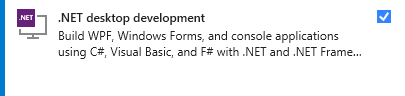

# LookupIPtoDNSTool

  
  
  

  <a href="https://github.com/michaelmsonne/LookupIPtoDNSTool/issues/new?assignees=&labels=bug&template=01_BUG_REPORT.md&title=bug%3A+">Report a Bug</a>
  ·
  <a href="https://github.com/michaelmsonne/LookupIPtoDNSTool/issues/new?assignees=&labels=enhancement&template=02_FEATURE_REQUEST.md&title=feat%3A+">Request a Feature</a>
  .
  <a href="https://github.com/michaelmsonne/LookupIPtoDNSTool/discussions">Ask a Question</a>

## Table of Contents
- [Introduction](#introduction)
- [Features](#features)
- [Getting Started](#getting-started)
  - [Prerequisites](#prerequisites)
  - [Installation](#installation)
  - [Download](#Download)
- [Contributing](#contributing)
- [License](#license)

## Contents

Outline the file contents of the repository. It helps users navigate the codebase, build configuration and any related assets.

| File/folder       | Description                                 |
|-------------------|---------------------------------------------|
| `\IPtoDNSLookup`  | Source code.                                |
| `\docs/pictures`  | Images for the README.                      |
| `.gitignore`      | Define what to ignore at commit time.       |
| `CHANGELOG.md`    | List of changes to the sample.              |
| `CONTRIBUTING.md` | Guidelines for contributing to the TEMPLATE.|
| `README.md`       | This README file.                           |
| `SECURITY.md`     | Security file.                              |
| `LICENSE`         | The license for the project .               |

## Introduction
The Lookup IP to DNS Tool is a C# utility designed to resolve IP addresses to their corresponding DNS hostnames asynchronously.
This tool is built using asynchronous programming techniques to provide efficient and non-blocking IP-to-DNS resolution.

## Features

### Overall:
- Asynchronous IP-to-DNS resolution for improved performance and responsiveness.
- Simple and easy-to-use.
- Supports both IPv4 and IPv6 addresses.
- Error handling for invalid or unresolved IP addresses.

### List:
- DNS Lookup Functionality:
    The tool provides the ability to perform DNS lookups on IP addresses.
    It can resolve IP addresses to their corresponding domain names.

- User Interface:
    The tool includes a user-friendly graphical interface.
    It uses dialog boxes and message boxes to provide feedback to the user.

- Input Validation:
    The tool validates the input IP addresses to ensure they are in the correct format.
    It identifies and reports invalid IP addresses to the user.

- Backup Result Display:
    The tool displays the results of DNS lookups in a DataGridView for easy reference.
    It supports dynamic column sizing and formatting for better visibility.

- Backup Export to CSV:
    Users can export the backup results to a CSV file for further analysis.
    It provides an option to select the destination path for the exported CSV file.

- Error Handling and Reporting:
    The tool handles errors gracefully and provides informative error messages to the user.
    It distinguishes between different types of errors, such as host non-existence.

- Cancellation Support:
    Users can cancel the DNS lookup task if it's in progress.
    The tool supports the cancellation of the operation and informs the user about the cancellation status.

- Ready Status and Version Information:
    The tool displays a "Ready" status in the form status bar.
    It includes the version number in the title to indicate the tool's version.

- Thread-Safe Processing:
    The tool employs thread-safe techniques to handle multiple IP addresses concurrently.
    It prevents duplicates and manages parallel DNS lookups.

## Getting Started
### Prerequisites
- [.NET](https://dotnet.microsoft.com/download) installed on your system.

### How to build

- Get [Visual Studio 2022](https://visualstudio.microsoft.com/vs/community/) (Community Edition is fine)
- Install ".NET desktop development" workload (.NET Framework 4.8)  
  
- Build the solution in Visual Studio

### Installation
You can either clone this repository and build the project yourself or download the latest release from the [releases page](../../releases/latest) and you are good to go - just run the .exe! 🤘

## Download

[Download the latest version](../../releases/latest)

[Version History](CHANGELOG.MD)

# Contributing
If you want to contribute to this project, please open an issue or submit a pull request. I welcome contributions :)

See [CONTRIBUTING](CONTRIBUTING.md) for more information.

First off, thanks for taking the time to contribute! Contributions are what makes the open-source community such an amazing place to learn, inspire, and create. Any contributions you make will benefit everybody else and are **greatly appreciated**.
Feel free to send pull requests or fill out issues when you encounter them. I'm also completely open to adding direct maintainers/contributors and working together! :)

Please try to create bug reports that are:

- _Reproducible._ Include steps to reproduce the problem.
- _Specific._ Include as much detail as possible: which version, what environment, etc.
- _Unique._ Do not duplicate existing opened issues.
- _Scoped to a Single Bug._ One bug per report.

# Support

Reach out to the maintainer at one of the following places:

- [GitHub discussions](https://github.com/michaelmsonne/LookupIPtoDNSTool/discussions)
- The email which is located [in GitHub profile](https://github.com/michaelmsonne)

# License
This project is licensed under the **MIT License** - see the LICENSE file for details.

See [LICENSE](LICENSE.md) for more information.

# Sponsors
## Advanced Installer
The installer is created from a Free Advanced Installer License for Open-Source from <a href="https://www.advancedinstaller.com/" target="_blank">https://www.advancedinstaller.com/</a> - check it out!

## SAST Tools
[PVS-Studio](https://pvs-studio.com/en/pvs-studio/?utm_source=github&utm_medium=organic&utm_campaign=open_source) - static analyzer for C, C++, C#, and Java code.